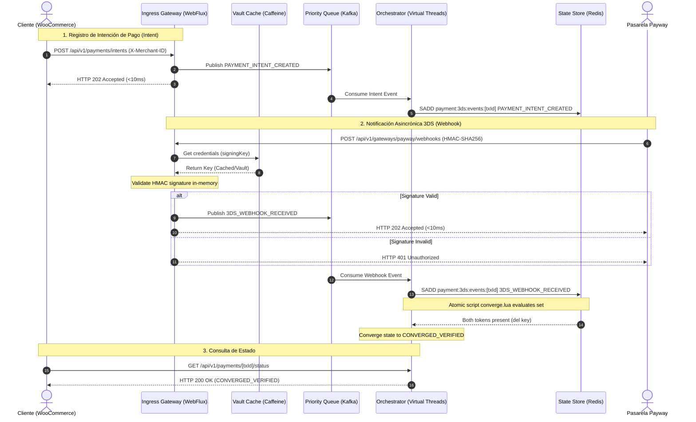
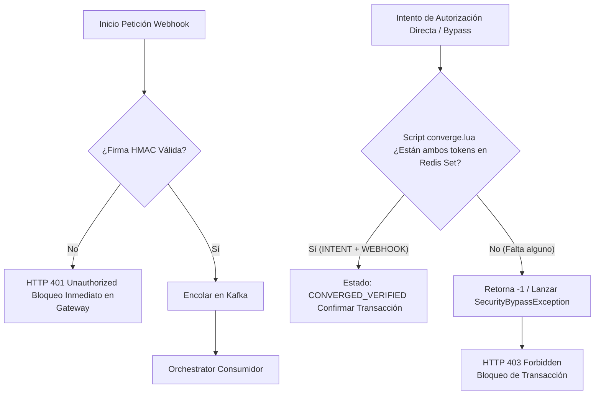
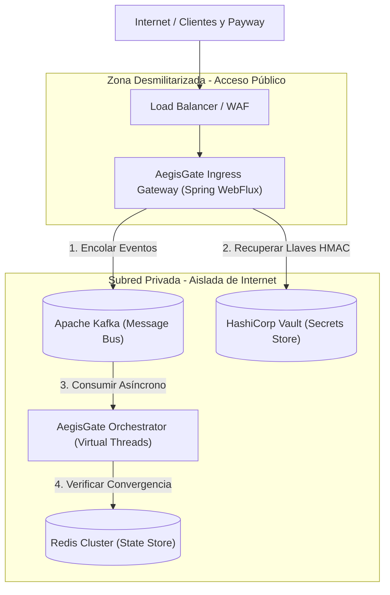
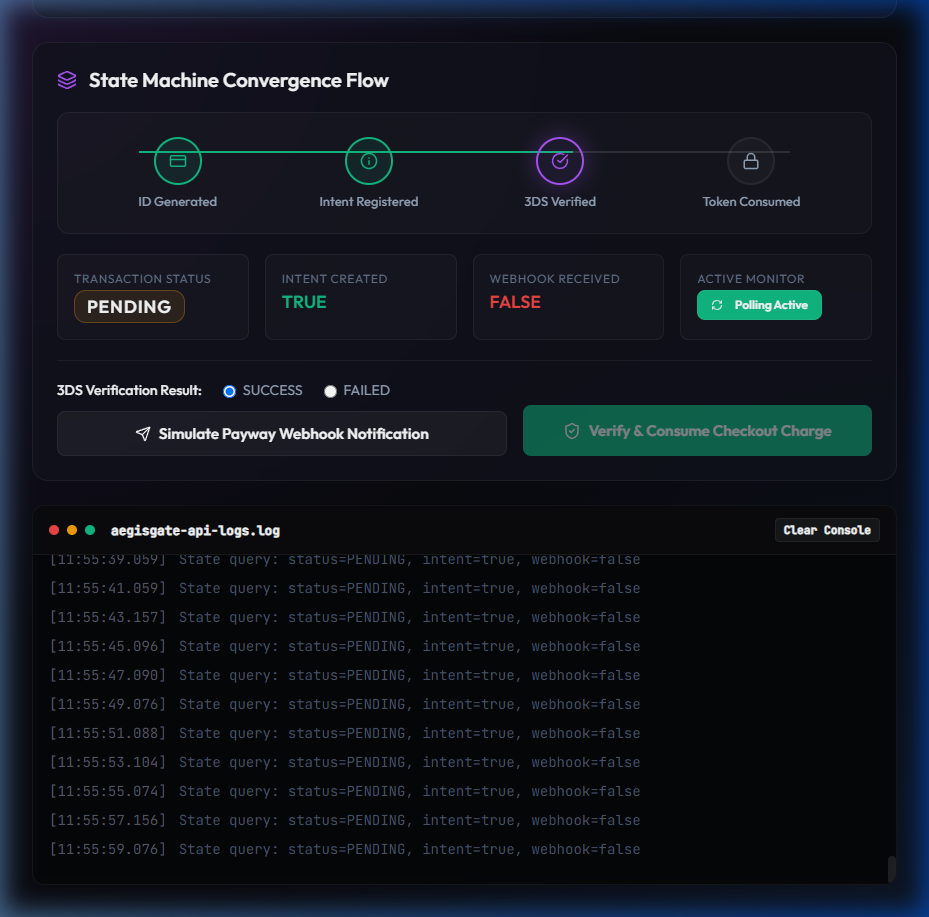
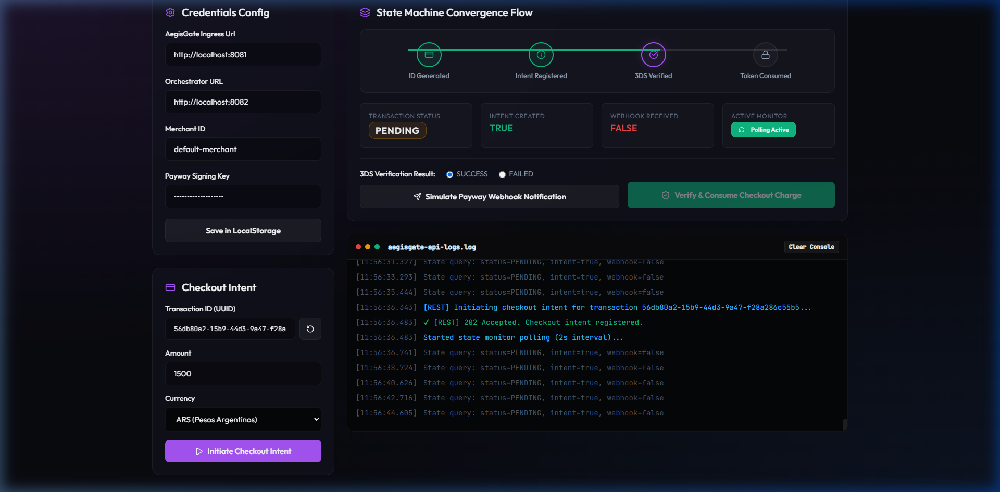
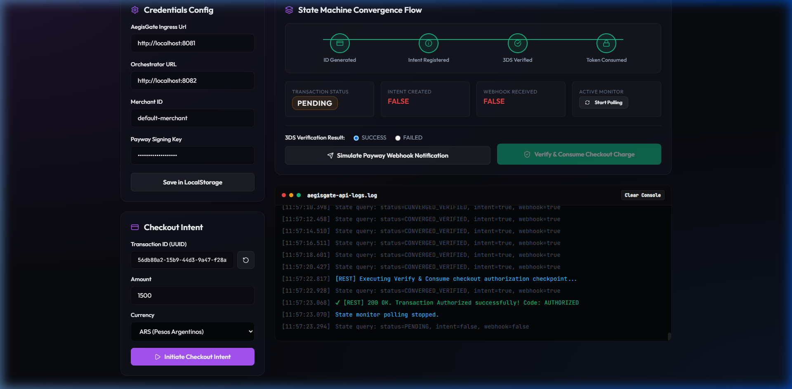
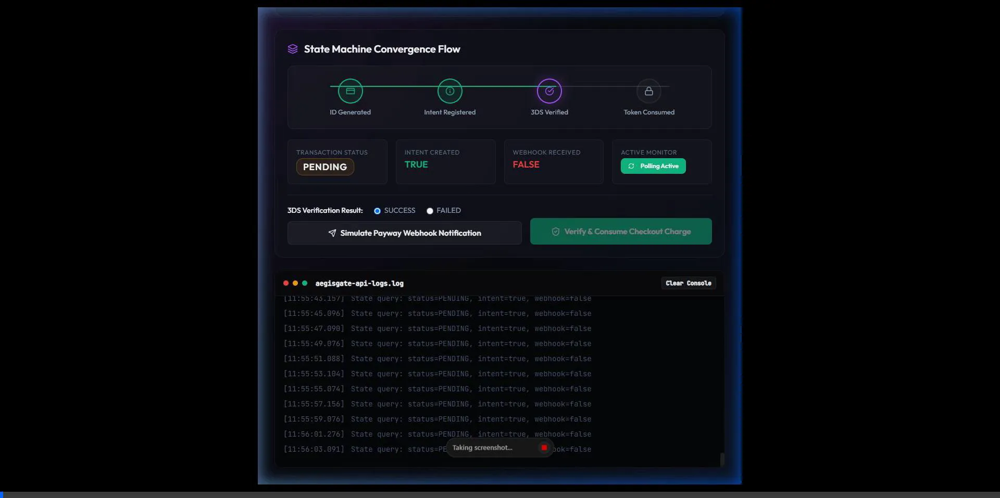

# AegisGate 3DS Verification Engine

AegisGate es un motor de verificación de transacciones 3D Secure (3DS) altamente resistente, diseñado en Java 21 y Spring Boot. Cuenta con una arquitectura desacoplada orientada a eventos para procesar pagos seguros con latencia ultra baja, resiliencia ante condiciones de carrera y protección contra fraudes por bypass.

---

## 🧠 Filosofía de Diseño: ¿Por qué solo 3DS? (No es una pasarela común)

AegisGate **no es una pasarela de pagos tradicional** (no gestiona capturas de tarjetas directas, cobros recurrentes ni autorizaciones simples). Es un **motor especializado de orquestación, validación criptográfica y convergencia de estado para desafíos 3D Secure (3DS)**.

El aislamiento absoluto del flujo 3DS de los flujos de pago directo convencionales se fundamenta en:

1.  **Protección Absoluta contra Bypass**: Al desacoplar la validación 3DS del flujo de cobro primario y requerir de forma atómica la presencia de los dos tokens (`INTENT` + `WEBHOOK:SUCCESS`) a nivel de base de datos en memoria (Redis), se anula por completo la posibilidad de que un atacante "salte" la validación bancaria inyectando respuestas de éxito simuladas.
2.  **Reducción del Alcance (Scope) de PCI-DSS**: El procesamiento y verificación de desafíos de autenticación 3DS implican requerimientos de seguridad y auditoría rigurosos. Aislar esta lógica en AegisGate permite que el resto del ecosistema de pagos de la plataforma permanezca fuera de este alcance crítico de auditoría, reduciendo costos y simplificando el cumplimiento normativo.

---

## 📊 Arquitectura y Diagramas de Secuencia

Para comprender el flujo y el comportamiento asincrónico del sistema, a continuación se detallan los diagramas de funcionamiento y seguridad:

### 1. Flujo de Secuencia 3D Secure (Happy Path)
Este diagrama ilustra el registro del Checkout Intent, la posterior recepción del Webhook criptográfico de Payway, la evaluación atómica en Redis y la verificación final del estado.



### 2. Flujo de Control de Seguridad y Mitigación de Bypass
AegisGate previene el fraude por bypass asegurando que ninguna transacción sea autorizada directamente en la base de datos sin haber completado exitosamente la validación cruzada.



### 3. Arquitectura de Despliegue Físico y Seguridad de Red
El despliegue en entornos productivos exige una separación estricta de red por zonas para mitigar vectores de ataque hacia el orquestador y los almacenes de datos:



*   **Ingress Gateway (DMZ)**: Único componente expuesto públicamente. Al ser completamente stateless y carecer de conexión directa a bases de datos relacionales, una vulnerabilidad en este nodo no compromete datos persistentes del negocio.
*   **State Orchestrator & Almacenes (Subred Privada)**: Totalmente aislados del exterior. La comunicación se realiza de forma desacoplada y asíncrona a través del bus de eventos de Kafka.

---

## 📊 Monitoreo y Observabilidad (Production-Ready)
Ambos microservicios exponen telemetría de producción mediante **Spring Boot Actuator** y **Micrometer Prometheus**.

### Endpoints de Monitoreo
*   **Ingress Gateway (Puerto 8081)**:
    *   **Health Check & Probes**: [http://localhost:8081/actuator/health](http://localhost:8081/actuator/health)
    *   **Métricas Prometheus**: [http://localhost:8081/actuator/prometheus](http://localhost:8081/actuator/prometheus)
*   **State Orchestrator (Puerto 8082)**:
    *   **Health Check & Probes**: [http://localhost:8082/actuator/health](http://localhost:8082/actuator/health)
    *   **Métricas Prometheus**: [http://localhost:8082/actuator/prometheus](http://localhost:8082/actuator/prometheus)

### Indicadores Clave de Rendimiento (SLIs)
1.  `http_server_requests_seconds`: Monitoreo del percentil 99 (p99) de latencia para certificar que el gateway responde en menos de 10ms (SC-001).
2.  `jvm_threads_live_threads`: Vigilancia de hilos nativos activos y portadores de hilos virtuales de Java 21.
3.  `aegisgate.security.bypass.attempts` (Excepciones): Alarmas automáticas ante bloqueos de transacciones por tokens ausentes en Redis.

---

## 🛠️ Requisitos Previos

Asegúrate de tener instalados los siguientes componentes antes de iniciar:

* **Java Development Kit (JDK) 21** (con soporte nativo para Virtual Threads)
* **Docker** y **Docker Compose**
* **Maven 3.9+** (o el empaquetador de la IDE como IntelliJ/Eclipse)
* **curl** (o cliente API como Postman/Insomnia) para las pruebas manuales

---

## 🚀 Paso a Paso: Puesta en Marcha

Sigue estos cuatro pasos para tener el sistema completo corriendo y listo para pruebas:

### Paso 1: Levantar Servicios de Infraestructura (Backing Services)
Inicia los servicios base (Redis, Apache Kafka en modo KRaft y HashiCorp Vault en modo de desarrollo) a través de Docker Compose:

```bash
# Navega al directorio del docker compose
cd zyrconpay-aegisgate/docker

# Levanta los contenedores en segundo plano (detached mode)
docker compose up -d
```

Puedes validar que los contenedores estén corriendo ejecutando `docker compose ps`.

---

### Paso 2: Sembrar Secretos en Vault
Inicializa las claves criptográficas simétricas de firma y claves API de los Merchants de prueba en el almacén seguro de HashiCorp Vault:

```bash
# Vuelve a la raíz del proyecto y dale permisos al script de sembrado
cd ../
chmod +x scripts/setup-vault-mock-secrets.sh

# Ejecuta el script seeder
./scripts/setup-vault-mock-secrets.sh
```

*(Esto sembrará la clave `alpha-key-secret` para el merchant `merchant-alpha` y `test-secret-key-123` para el merchant `default-merchant`).*

---

### Paso 3: Compilar y Ejecutar los Servicios
AegisGate está dividido en módulos desacoplados. Compila todo el proyecto e inicia los servicios:

```bash
# Compila e instala todos los módulos Maven
mvn clean install -DskipTests

# Ejecutar el Ingress Gateway (Recibe peticiones HTTP, valida firmas en memoria y encola en Kafka)
mvn -pl aegisgate-ingress spring-boot:run

# (En otra terminal) Ejecutar el State Orchestrator (Consume de Kafka, valida el estado atómico en Redis en Virtual Threads)
mvn -pl aegisgate-orchestrator spring-boot:run
```

* **Ingress Gateway** correrá en el puerto: `8081`
* **State Orchestrator** correrá en el puerto: `8082`

---

## 📖 Documentación Interactiva de la API (Swagger UI & OpenAPI)

AegisGate incluye integración con **Springdoc OpenAPI** para generar documentación interactiva y permitir pruebas directamente desde el navegador:

* **Ingress Gateway (Puerto 8081)**:
  * **Swagger UI**: [http://localhost:8081/swagger-ui.html](http://localhost:8081/swagger-ui.html)
  * **Especificación OpenAPI (JSON)**: [http://localhost:8081/v3/api-docs](http://localhost:8081/v3/api-docs)
* **State Orchestrator (Puerto 8082)**:
  * **Swagger UI**: [http://localhost:8082/swagger-ui.html](http://localhost:8082/swagger-ui.html)
  * **Especificación OpenAPI (JSON)**: [http://localhost:8082/v3/api-docs](http://localhost:8082/v3/api-docs)

Ambos servicios exponen sus rutas y DTOs correspondientes para que puedas probar las peticiones directamente y explorar la estructura de datos.

---

## 🧪 Escenarios de Pruebas Manuales (Validación E2E)

Abre otra terminal para realizar las pruebas utilizando `curl` contra los servicios locales activos.

### Escenario 1: Flujo Estándar Exitoso (Intent primero, luego Webhook)
Registra la intención de pago del cliente y posteriormente recibe la confirmación criptográfica de la pasarela de pagos.

#### 1. Registrar Checkout Intent (Ingress)
```bash
curl -X POST http://localhost:8081/api/v1/payments/intents \
  -H "Content-Type: application/json" \
  -H "X-Merchant-ID: merchant-alpha" \
  -d '{
    "transactionId": "tx-flow-happy-999",
    "amount": 1500.0,
    "currency": "ARS"
  }'
```
**Respuesta esperada**: `202 Accepted`

#### 2. Confirmación de Webhook de 3DS (Ingress)
Usamos la firma de prueba `valid-alpha-signature` para validar el callback seguro.
```bash
curl -X POST http://localhost:8081/api/v1/gateways/payway/webhooks \
  -H "Content-Type: application/json" \
  -H "X-Merchant-ID: merchant-alpha" \
  -d '{
    "id": "tx-flow-happy-999",
    "status": "approved",
    "amount": 1500.0,
    "signature": "valid-alpha-signature"
  }'
```
**Respuesta esperada**: `202 Accepted`

#### 3. Consultar Estado Convergido (Orchestrator)
El orquestador procesa ambos eventos y converge en estado verificado (`CONVERGED_VERIFIED`):
```bash
curl http://localhost:8082/api/v1/payments/tx-flow-happy-999/status
```
**Respuesta esperada**: `200 OK`
```json
{
  "transactionId": "tx-flow-happy-999",
  "hasPaymentIntent": true,
  "hasWebhookReceived": true,
  "status": "CONVERGED_VERIFIED"
}
```

---

### Escenario 2: Condición de Carrera / Orden Inverso (Webhook primero, luego Intent)
Prueba la resiliencia del motor cuando el webhook de la entidad bancaria llega antes de que la aplicación cliente registre la intención de pago.

#### 1. Enviar Webhook Primero
```bash
curl -X POST http://localhost:8081/api/v1/gateways/payway/webhooks \
  -H "Content-Type: application/json" \
  -H "X-Merchant-ID: merchant-alpha" \
  -d '{
    "id": "tx-flow-race-888",
    "status": "approved",
    "amount": 2500.0,
    "signature": "valid-alpha-signature"
  }'
```
**Respuesta esperada**: `202 Accepted` (El webhook queda en caché temporal con TTL de 600 segundos).

#### 2. Registrar Checkout Intent Posteriormente
```bash
curl -X POST http://localhost:8081/api/v1/payments/intents \
  -H "Content-Type: application/json" \
  -H "X-Merchant-ID: merchant-alpha" \
  -d '{
    "transactionId": "tx-flow-race-888",
    "amount": 2500.0,
    "currency": "ARS"
  }'
```
**Respuesta esperada**: `202 Accepted`

#### 3. Verificar Convergencia de Estado
El sistema asocia el intent tardío y consolida la transacción:
```bash
curl http://localhost:8082/api/v1/payments/tx-flow-race-888/status
```
**Respuesta esperada**: `200 OK`
```json
{
  "transactionId": "tx-flow-race-888",
  "hasPaymentIntent": true,
  "hasWebhookReceived": true,
  "status": "CONVERGED_VERIFIED"
}
```

---

### Escenario 3: Prevención de Firma Alterada (HMAC Fails)
Verifica que las peticiones falsas de webhook con firmas incorrectas sean bloqueadas en el Gateway.

```bash
curl -X POST http://localhost:8081/api/v1/gateways/payway/webhooks \
  -H "Content-Type: application/json" \
  -H "X-Merchant-ID: merchant-alpha" \
  -d '{
    "id": "tx-flow-hack-111",
    "status": "approved",
    "amount": 10.0,
    "signature": "invalid-hacker-signature"
  }'
```
**Respuesta esperada**: `401 Unauthorized`

---

## 📈 Pruebas de Integración y Calidad Automatizadas

Para ejecutar las pruebas automatizadas del sistema, incluyendo los tests de Testcontainers (Kafka y Redis) y las pruebas estructurales de boundaries de ArchUnit:

```bash
# Corre todos los tests automatizados del proyecto
mvn test
```

---

## 🖥️ Interfaz de Pruebas: AegisGate Checkout Sandbox UI

Para facilitar la interacción y el testing de este motor asíncrono, se incluye una interfaz Sandbox interactiva desarrollada en React (dentro del módulo `aegisgate-sandbox-ui`). Esta UI simula la tienda online y calcula firmas HMAC-SHA256 en tiempo real en el navegador usando la Web Crypto API.

### Galería de la Interfaz en Acción

#### 1. Estado Inicial del Panel (Carga de credenciales persistidas)


#### 2. Checkout Intent Registrado (Estado PENDING con el intent consolidado en Redis)


#### 3. Transacción Autorizada y Token Consumido (Retorno: AUTHORIZED)


#### 4. Simulación Completa End-to-End Animada


