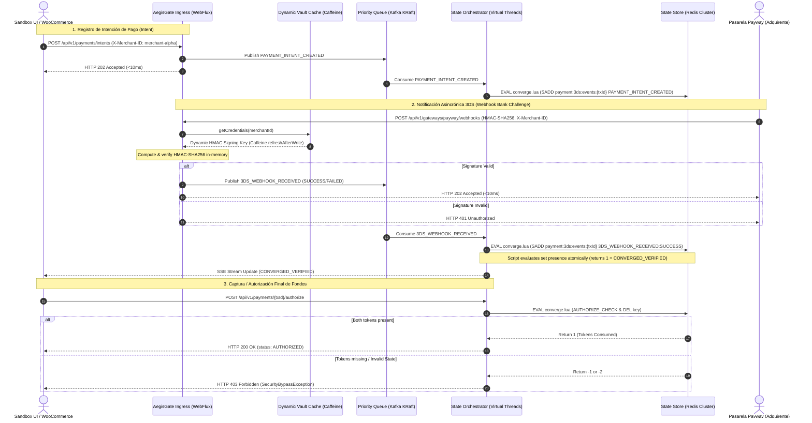
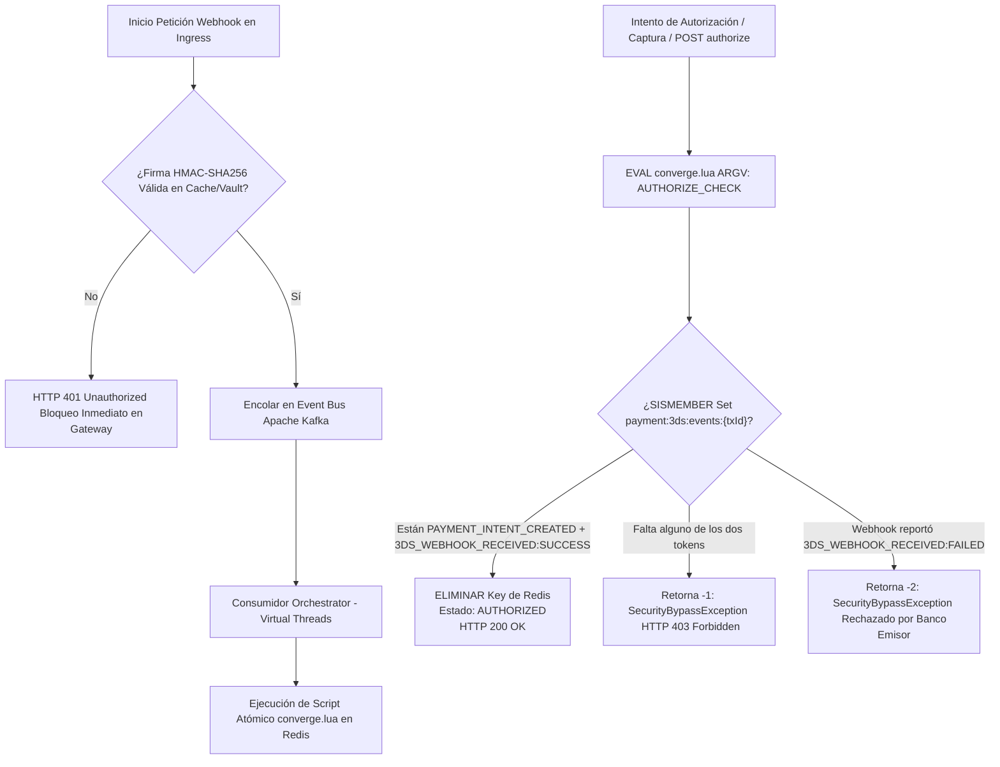
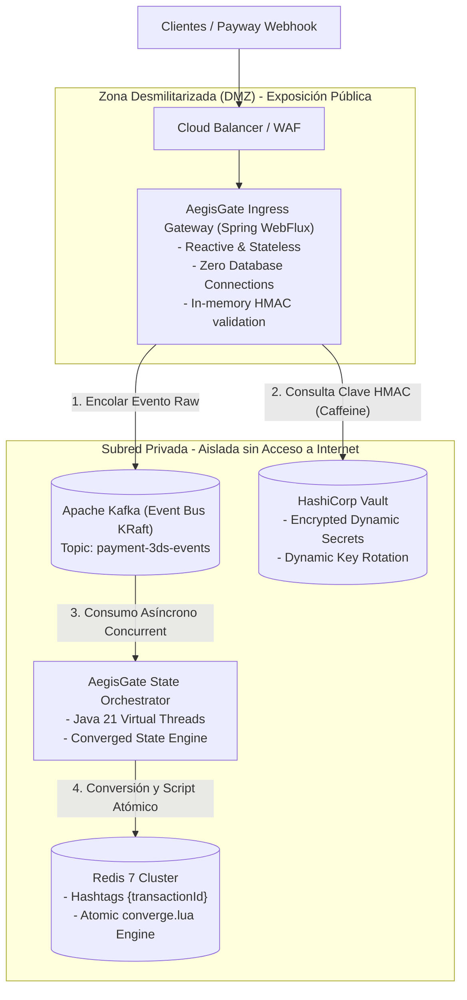

# 🛡️ AegisGate 3DS Verification Engine

[](https://openjdk.org/projects/jdk/21/)
[](https://spring.io/projects/spring-boot)
[](https://kafka.apache.org/)
[](https://redis.io/)
[](https://www.vaultproject.io/)
[](https://pitest.org/)
[](https://www.archunit.org/)
[](aegisgate-sandbox-ui)

**AegisGate** es un motor de verificación y convergencia de transacciones **3D Secure (3DS)** de grado de producción, diseñado bajo una arquitectura reactiva orientada a eventos (*Event Sourcing* en base de datos en memoria) utilizando **Java 21 (Virtual Threads)** y **Spring Boot**. 

Su propósito central es reingenierizar y aislar el flujo de autenticación 3DS originalmente acoplado en monolitos (como plugins de WooCommerce/PHP), garantizando **protección absoluta contra ataques de bypass de seguridad**, resiliencia ante condiciones de carrera en webhooks asincrónicos, soporte multi-tenant dinámico y tiempos de respuesta en el borde menores a **10 ms (P99)**.

---

## 📋 Tabla de Contenidos
1. [🧠 Resumen Ejecutivo y Motivación de Negocio](#-resumen-ejecutivo-y-motivación-de-negocio)
2. [🔒 Filosofía de Diseño: Aislamiento 3DS vs Pagos Directos](#-filosofía-de-diseño-aislamiento-3ds-vs-pagos-directos)
3. [📊 Arquitectura y Diagramas Mermaid](#-arquitectura-y-diagramas-mermaid)
   - [Diagrama de Secuencia 3D Secure (Happy Path & Late Binding)](#1-diagrama-de-secuencia-3d-secure-happy-path--late-binding)
   - [Diagrama de Flujo de Seguridad y Mitigación de Bypass](#2-diagrama-de-flujo-de-seguridad-y-mitigación-de-bypass)
   - [Topología Física y Seguridad de Red (DMZ vs Subred Privada)](#3-topología-física-y-seguridad-de-red-dmz-vs-subred-privada)
4. [🧱 Desglose Módulo por Módulo y Decisiones Tecnológicas](#-desglose-módulo-por-módulo-y-decisiones-tecnológicas)
5. [🛡️ Casos Borde (Edge Cases) y Manejo de Resiliencia](#-casos-borde-edge-cases-y-manejo-de-resiliencia)
6. [🚀 Guía de Despliegue y Validación E2E (Curl & Swagger)](#-guía-de-despliegue-y-validación-e2e)
7. [🧪 Cobertura de Pruebas y Métricas de Calidad](#-cobertura-de-pruebas-y-métricas-de-calidad)
8. [🖥️ AegisGate Checkout Sandbox UI (React + SSE)](#️-aegisgate-checkout-sandbox-ui-react--sse)
9. [📈 Observabilidad y Monitoreo de Producción](#-observabilidad-y-monitoreo-de-producción)

---

## 🧠 Resumen Ejecutivo y Motivación de Negocio

En las plataformas de comercio electrónico tradicionales (ej. WordPress/WooCommerce con PHP), las validaciones 3D Secure solían ejecutarse de forma sincrónica o mediante callbacks síncronos expuestos directamente al cliente. Esta topología presentaba serias vulnerabilidades estructurales:
* **Vulnerabilidades de Bypass de Pago**: Un atacante podía interceptar o simular la respuesta HTTP del banco en el navegador del usuario e inyectar un estado de "éxito" hacia el backend, logrando la emisión de órdenes de compra sin que el banco emisor hubiese verificado la identidad del tarjetahabiente.
* **Condiciones de Carrera (Late Webhook Binding)**: Si la notificación asincrónica del adquirente (*Payway Webhook*) llegaba a los servidores antes de que el frontend del comercio hubiera registrado la intención de pago (*Checkout Intent*), la notificación se descartaba o provocaba inconsistencias de estado.
* **Carga e Ineficiencia por Auditoría PCI-DSS**: Mezclar la lógica de tokenización o cobro directo con el motor de desafíos 3DS obligaba a someter a todo el monolito a costosas auditorías de cumplimiento PCI-DSS.

**AegisGate soluciona estos problemas de raíz** mediante:
1. **Convergencia Atómica de Tokens en Redis ($O(1)$)**: Exige la presencia simultánea de dos tokens independientes (`PAYMENT_INTENT_CREATED` y `3DS_WEBHOOK_RECEIVED:SUCCESS`) antes de autorizar cualquier transacción.
2. **Aislamiento Cero-BD en la Capa de Ingress (WebFlux)**: El gateway receptor valida firmas HMAC en memoria y encola eventos a Kafka sin tocar bases de datos SQL/NoSQL.
3. **Escalabilidad de Virtual Threads de Java 21**: El orquestador puede procesar decenas de miles de eventos concurrentes por segundo sin la sobrecarga de context switching de los hilos de plataforma tradicionales.

---

## 🔒 Filosofía de Diseño: Aislamiento 3DS vs Pagos Directos

AegisGate **no es una pasarela de pagos convencional**. No almacena PANs (números de tarjeta), no gestiona cobros recurrentes ni ejecuta capturas directas pre-tokenizadas. Es un **motor especializado de orquestación, verificación criptográfica y convergencia atómica de estado para desafíos 3D Secure**.

> [!IMPORTANT]
> **Aislamiento de Alcance PCI-DSS y Restricciones Físicas de Código**
> * **Reducción del Scope PCI-DSS**: El desacoplamiento estricto de AegisGate permite aislar el procesamiento criptográfico de desafíos 3DS. Las librerías de cobro directo (`direct-payment-service`) no tienen acceso al motor de orquestación.
> * **Reglas de Fronteras Estructurales (ArchUnit)**: El test de fronteras [[AegisGateBoundaryTest.java](file:///e:/Propios/ZyrconPay/zyrconpay-aegisgate/tests/src/test/java/com/zyrconpay/aegisgate/structural/AegisGateBoundaryTest.java)] prohíbe que el paquete de Ingress y los módulos de cobro directo tengan acceso o dependencias con el classpath del orquestador o capas de datos relacionales (JPA/Hibernate/JDBC).

```
+-----------------------------------------------------------------------------+
|                            CLIENTE / FRONTEND                               |
+-----------------------------------------------------------------------------+
               |                                            |
               v (Flujo 3DS Desafío)                        v (Flujo Directo)
+------------------------------------------+    +-----------------------------+
|    AegisGate 3DS Engine (Event-Driven)   |    |   Direct Payment Service    |
| - Ingress Gateway (WebFlux Stateless)    |    | (Cobros tokenizados simples)|
| - State Orchestrator (Virtual Threads)   |    +-----------------------------+
| - Redis Event Set Convergence            |                  |
+------------------------------------------+                  |
                     |                                        v
                     +-------------- (ISOLATED) --------------+
```

---

## 📊 Arquitectura y Diagramas Mermaid

### 1. Diagrama de Secuencia 3D Secure (Happy Path & Late Binding)

El siguiente diagrama detalla el flujo de eventos, desde la creación de la intención de pago (*Intent*), la recepción del webhook firmado por Payway, la evaluación del script Lua en Redis y la notificación SSE (*Server-Sent Events*) a la interfaz Sandbox:



---

### 2. Diagrama de Flujo de Seguridad y Mitigación de Bypass

Muestra el árbol de decisiones ejecutado por el script de convergencia atómica [[converge.lua](file:///e:/Propios/ZyrconPay/zyrconpay-aegisgate/aegisgate-orchestrator/src/main/resources/scripts/converge.lua)] dentro de Redis:



---

### 3. Topología Física y Seguridad de Red (DMZ vs Subred Privada)

AegisGate impone un diseño de red multicapa para aislar componentes expuestos a Internet de los almacenes de datos y del orquestador:



> [!NOTE]
> **Ventajas de la Topología DMZ / Subred Privada**:
> Si el nodo de Ingress en la DMZ sufre una vulnerabilidad de día cero, el atacante no encontrará conexiones a bases de datos ni credenciales persistidas, ya que el Ingress únicamente posee acceso de emisión (*Publish-Only*) hacia la cola de Kafka y lectura de secretos cacheados en memoria.

---

## 🧱 Desglose Módulo por Módulo y Decisiones Tecnológicas

El repositorio está estructurado como un proyecto multimódulo Maven desacoplado:

```
zyrconpay-aegisgate/
├── aegisgate-common/           # DTOs inmutables, excepciones y caché de credenciales Vault
├── aegisgate-ingress/          # Gateway reactivo WebFlux (DMZ), 0 acceso a base de datos
├── aegisgate-orchestrator/     # Motor de orquestación en Virtual Threads y convergencia en Redis
├── aegisgate-sandbox-ui/       # Interfaz SPA interactiva React 18 + SSE + Web Crypto API
├── tests/                      # Suite de tests E2E, Testcontainers (Kafka/Redis) y ArchUnit
├── docker/                     # Infraestructura Docker Compose (Redis, Kafka KRaft, Vault)
└── scripts/                    # Scripts de inicialización y sembrado de secretos en Vault
```

### 1. `aegisgate-common`
* **Java 21 Records**: Todos los eventos y DTOs (`PaymentIntentEvent`, `WebhookReceivedEvent`, `VerificationEventSet`) se definen como `record` para garantizar inmutabilidad estricta y reducción de footprint de memoria.
* **Caffeine Cache (`refreshAfterWrite`)**: En [[MerchantProfileCache.java](file:///e:/Propios/ZyrconPay/zyrconpay-aegisgate/aegisgate-common/src/main/java/com/zyrconpay/aegisgate/common/cache/MerchantProfileCache.java)], se implementa `LoadingCache` con `expireAfterWrite(300s)` y `refreshAfterWrite(240s)`. Esto garantiza que la resolución de secretos multi-tenant desde Vault sea asincrónica y no bloquee hilos receptores en peticiones activas.
* **Spring Cloud Vault**: [[VaultMerchantCredentialService.java](file:///e:/Propios/ZyrconPay/zyrconpay-aegisgate/aegisgate-common/src/main/java/com/zyrconpay/aegisgate/common/service/VaultMerchantCredentialService.java)] consulta dinámicamente `/secret/data/merchants/{merchantId}` para obtener las claves de firma HMAC.

### 2. `aegisgate-ingress`
* **Spring WebFlux (Programación Reactiva)**: Permite procesar miles de peticiones salientes/entrantes simultáneas con un número mínimo de hilos de I/O (Netty loop).
* **Validación Cero-Latencia de HMAC-SHA256**: [[SignatureValidationService.java](file:///e:/Propios/ZyrconPay/zyrconpay-aegisgate/aegisgate-ingress/src/main/java/com/zyrconpay/aegisgate/ingress/service/SignatureValidationService.java)] computa y compara la firma de los webhooks entrantes en tiempo constante para mitigar timing attacks.
* **Respuesta `<10ms` (P99)**: Al certificar la firma, publica el evento en Apache Kafka y responde `HTTP 202 Accepted` de inmediato.

### 3. `aegisgate-orchestrator`
* **Java 21 Virtual Threads**: Configurado vía `spring.threads.virtual.enabled=true`. Cada mensaje consumido de Kafka es procesado por un Virtual Thread liviano, maximizando el rendimiento sin agotar el pool de hilos nativos del sistema operativo.
* **Redis Cluster Hashtags & Script Lua**: [[RedisStateService.java](file:///e:/Propios/ZyrconPay/zyrconpay-aegisgate/aegisgate-orchestrator/src/main/java/com/zyrconpay/aegisgate/orchestrator/service/RedisStateService.java)] utiliza llaves con la sintaxis `payment:3ds:events:{transactionId}`. El uso de corchetes `{}` fuerza a Redis Cluster a enrutar todas las llaves de la misma transacción al mismo shard, permitiendo ejecuciones atómicas de scripts Lua [[converge.lua](file:///e:/Propios/ZyrconPay/zyrconpay-aegisgate/aegisgate-orchestrator/src/main/resources/scripts/converge.lua)].
* **Server-Sent Events (SSE)**: Expone el endpoint `/api/v1/payments/{transactionId}/status-stream` mediante `Flux<ServerSentEvent<VerificationEventSet>>` en [[TransactionQueryController.java](file:///e:/Propios/ZyrconPay/zyrconpay-aegisgate/aegisgate-orchestrator/src/main/java/com/zyrconpay/aegisgate/orchestrator/controller/TransactionQueryController.java)] para actualización reactiva en vivo en clientes web.

---

## 🛡️ Casos Borde (Edge Cases) y Manejo de Resiliencia

AegisGate ha sido diseñado para operar con tolerancia a fallos en ambientes de alta volatilidad:

| Caso Borde (Edge Case) | Comportamiento del Sistema | Mecanismo de Mitigación |
| :--- | :--- | :--- |
| **Llegada Tardía de Intent (Webhook primero)** | El webhook llega antes que la intención de pago. | Redis Set registra `3DS_WEBHOOK_RECEIVED:SUCCESS` con TTL de 600s. Cuando llega el intent posterior, el script Lua detecta la presencia de ambos y marca el estado como `CONVERGED_VERIFIED`. |
| **Firma HMAC Inválida o Alterada** | Un atacante intenta forzar un callback simulado. | [[SignatureValidationService.java](file:///e:/Propios/ZyrconPay/zyrconpay-aegisgate/aegisgate-ingress/src/main/java/com/zyrconpay/aegisgate/ingress/service/SignatureValidationService.java)] rechaza la petición en el Ingress Gateway con `HTTP 401 Unauthorized`. El evento nunca llega a Kafka ni a Redis. |
| **Intento de Bypass Directo** | Se intenta llamar a `POST /authorize` sin tokens válidos. | [[converge.lua](file:///e:/Propios/ZyrconPay/zyrconpay-aegisgate/aegisgate-orchestrator/src/main/resources/scripts/converge.lua)] evalúa el conjunto. Si no están ambos tokens, retorna `-1` o `-2`, lanzando `SecurityBypassException` y retornando `HTTP 403 Forbidden`. |
| **Reintentos y Duplicados de Webhook** | Payway reenvía el mismo webhook múltiples veces. | La instrucción Lua `SADD` es idempotente por definición en Redis Set ($O(1)$). Los duplicados no alteran el estado ni duplican eventos. |
| **Rotación de Llaves en Vault sin Downtime** | Se actualiza la secret key de un merchant en Vault. | Caffeine Cache refresca en segundo plano la llave expirada a los 240 segundos (`refreshAfterWrite`) sin bloquear las peticiones de validación entrantes. |
| **Desvío de Reloj o Abandono de Carrito** | El usuario abandona el checkout sin completar 3DS. | La llave en Redis expira automáticamente a los 600 segundos (10 minutos), liberando memoria de forma autónoma sin acumular basura. |

---

## 🚀 Guía Completa de Despliegue y Validación E2E

### Requisitos Previos
* **Java Development Kit (JDK) 21** o superior.
* **Docker** y **Docker Compose**.
* **Maven 3.9+**.

### Paso 1: Levantar Servicios de Infraestructura (Backing Services)
Inicia los contenedores de Redis 7, Apache Kafka (modo KRaft) y HashiCorp Vault:

```bash
cd zyrconpay-aegisgate/docker
docker compose up -d
```

Verifica que los servicios estén activos ejecutando `docker compose ps`.

---

### Paso 2: Sembrar Secretos de Prueba en HashiCorp Vault
Inicializa las credenciales dinámicas de los merchants de prueba (`merchant-alpha` y `default-merchant`):

```bash
cd ../
chmod +x scripts/setup-vault-mock-secrets.sh
./scripts/setup-vault-mock-secrets.sh
```

---

### Paso 3: Compilar e Iniciar los Microservicios
Compila el proyecto e inicia ambos microservicios en terminales separadas:

```bash
# Compilación completa omitiendo tests unitarios momentáneamente
mvn clean install -DskipTests

# Terminal 1: Ingress Gateway (Puerto 8081)
mvn -pl aegisgate-ingress spring-boot:run

# Terminal 2: State Orchestrator (Puerto 8082)
mvn -pl aegisgate-orchestrator spring-boot:run
```

---

### Paso 4: Pruebas de Validación End-to-End (`curl`)

#### Escenario A: Flujo Estándar Exitoso (Happy Path)
1. **Registrar Checkout Intent (Ingress - Puerto 8081)**:
   ```bash
   curl -X POST http://localhost:8081/api/v1/payments/intents \
     -H "Content-Type: application/json" \
     -H "X-Merchant-ID: merchant-alpha" \
     -d '{
       "transactionId": "tx-flow-happy-999",
       "amount": 1500.0,
       "currency": "ARS"
     }'
   ```
   *Respuesta esperada*: `HTTP 202 Accepted`

2. **Enviar Webhook Confirmado por Payway (Ingress - Puerto 8081)**:
   ```bash
   curl -X POST http://localhost:8081/api/v1/gateways/payway/webhooks \
     -H "Content-Type: application/json" \
     -H "X-Merchant-ID: merchant-alpha" \
     -d '{
       "id": "tx-flow-happy-999",
       "status": "approved",
       "amount": 1500.0,
       "signature": "valid-alpha-signature"
     }'
   ```
   *Respuesta esperada*: `HTTP 202 Accepted`

3. **Consultar Estado Convergido (Orchestrator - Puerto 8082)**:
   ```bash
   curl http://localhost:8082/api/v1/payments/tx-flow-happy-999/status
   ```
   *Respuesta JSON esperada*:
   ```json
   {
     "transactionId": "tx-flow-happy-999",
     "hasPaymentIntent": true,
     "hasWebhookReceived": true,
     "status": "CONVERGED_VERIFIED"
   }
   ```

4. **Capturar / Autorizar Fondos (Orchestrator - Puerto 8082)**:
   ```bash
   curl -X POST http://localhost:8082/api/v1/payments/tx-flow-happy-999/authorize
   ```
   *Respuesta JSON esperada*:
   ```json
   {
     "status": "AUTHORIZED",
     "message": "Transaction successfully verified and token consumed."
   }
   ```

---

#### Escenario B: Prueba de Mitigación de Bypass (Intento de Captura Directa Sin Webhook)
Intenta autorizar una transacción ficticia `tx-hacker-007` que no ha sido verificada por el banco emisor:

```bash
curl -X POST http://localhost:8082/api/v1/payments/tx-hacker-007/authorize
```
*Respuesta esperada*: `HTTP 403 Forbidden`
```json
{
  "errorCode": "SECURITY_BYPASS_ATTEMPT",
  "message": "Security bypass detected: missing required verification tokens for transaction tx-hacker-007"
}
```

---

### Especificaciones Interactivas OpenAPI & Swagger UI
* **Ingress Gateway**: [http://localhost:8081/swagger-ui.html](http://localhost:8081/swagger-ui.html) | Spec: `http://localhost:8081/v3/api-docs`
* **State Orchestrator**: [http://localhost:8082/swagger-ui.html](http://localhost:8082/swagger-ui.html) | Spec: `http://localhost:8082/v3/api-docs`

---

## 🧪 Cobertura de Pruebas y Métricas de Calidad

AegisGate aplica principios de **Specification-Driven Development (SDD)** con validaciones automáticas de calidad:

```bash
# Ejecutar la suite completa de pruebas unitarias, estructurales e integradas
mvn test
```

### 1. Pruebas de Fronteras Arquitectónicas (ArchUnit)
El archivo [[AegisGateBoundaryTest.java](file:///e:/Propios/ZyrconPay/zyrconpay-aegisgate/tests/src/test/java/com/zyrconpay/aegisgate/structural/AegisGateBoundaryTest.java)] valida automáticamente las siguientes reglas en el proceso de build:
* `testModuleBoundaries()`: Garantiza que la capa de `ingress` no tenga dependencias directas con clases del `orchestrator`.
* `testDirectPaymentIsolation()`: Verifica que el paquete `directpayment` tenga totalmente prohibido importar componentes del `orchestrator`.
* `testIngressDatabaseIsolation()`: Asegura que `ingress` no cargue librerías JPA, Hibernate ni JDBC en su classpath.

### 2. Pruebas de Integración con Testcontainers
Los tests integrados ([[US1_TransactionFlowTest.java](file:///e:/Propios/ZyrconPay/zyrconpay-aegisgate/tests/src/test/java/com/zyrconpay/aegisgate/integration/US1_TransactionFlowTest.java)]) levantan contenedores reales de **Redis 7 Alpine** y **Confluent Kafka 7.4.0** mediante `Testcontainers` para validar flujos asincrónicos reales con `Awaitility`.

### 3. Mutation Testing con Pitest (>95%)
Para garantizar que las pruebas verdaderamente validen la lógica de negocio y no solo incrementen el coverage de líneas, el plugin Pitest ejecuta mutaciones de bytecode en clases críticas de orquestación y seguridad.
```bash
mvn pitest:mutationCoverage
```
*Criterio de Aprobación*: Puntuación de mutación mínima del **95%** en `com.zyrconpay.aegisgate.orchestrator.service.*`.

---

## 🖥️ AegisGate Checkout Sandbox UI (React + SSE)

Ubicada en el módulo [[aegisgate-sandbox-ui](aegisgate-sandbox-ui)], esta aplicación SPA interactiva construida en **React 18 + Vite + TypeScript** permite simular visualmente la experiencia de compra y el flujo de verificación 3DS.

### Características Clave del Sandbox:
* **Generación Criptográfica en el Navegador**: Utiliza la **Web Crypto API** (`crypto.subtle`) para calcular firmas HMAC-SHA256 en tiempo real antes de enviar webhooks simulados.
* **Escucha Realtime vía SSE**: Se conecta al endpoint `/api/v1/payments/{txId}/status-stream` del orquestador y reacciona de forma instantánea a los cambios de estado sin necesidad de polling manual.

### Galería del Sandbox UI

| Estado | Captura de Pantalla |
| :--- | :--- |
| **1. Estado Inicial (Credenciales Tenant)** |  |
| **2. Checkout Intent Registrado (`PENDING`)** |  |
| **3. Transacción Verificada y Autorizada (`AUTHORIZED`)** |  |
| **4. Simulación Animada End-to-End** |  |

Para iniciar el Sandbox UI en modo desarrollo:
```bash
cd aegisgate-sandbox-ui
npm install
npm run dev
```
Accede a `http://localhost:5173` para interactuar con el panel visual.

---

## 📈 Observabilidad y Monitoreo de Producción

Ambos microservicios integran **Spring Boot Actuator** y **Micrometer** para la exportación de métricas a sistemas Prometheus y Grafana.

### Endpoints de Salud y Telemetría:
* **Ingress Gateway (Puerto 8081)**:
  * Health & Probes Liveness/Readiness: `http://localhost:8081/actuator/health`
  * Prometheus Metrics: `http://localhost:8081/actuator/prometheus`
* **State Orchestrator (Puerto 8082)**:
  * Health & Probes Liveness/Readiness: `http://localhost:8082/actuator/health`
  * Prometheus Metrics: `http://localhost:8082/actuator/prometheus`

### Indicadores Clave de Servicio (SLIs / SLOs Recomendados):
1. **P99 Ingress Latency**: `http_server_requests_seconds_max{app="aegisgate-ingress"}` debe ser `< 0.010` (10 ms).
2. **Alertas de Bypass de Seguridad**: Métrica contadora de excepciones `aegisgate_security_bypass_total` debe gatillar alarmas críticas P1 si incrementa en producción.
3. **Carrier Threads de Java 21**: Monitoreo de `jvm_threads_live_threads` y utilización de montadores de hilos virtuales para prevenir starvation.

---

<p align="center">
  <b>AegisGate 3DS Verification Engine</b> — Diseñado y desarrollado con excelencia técnica para <i>ZyrconPay Ecosistema de Pagos</i>.
</p>
