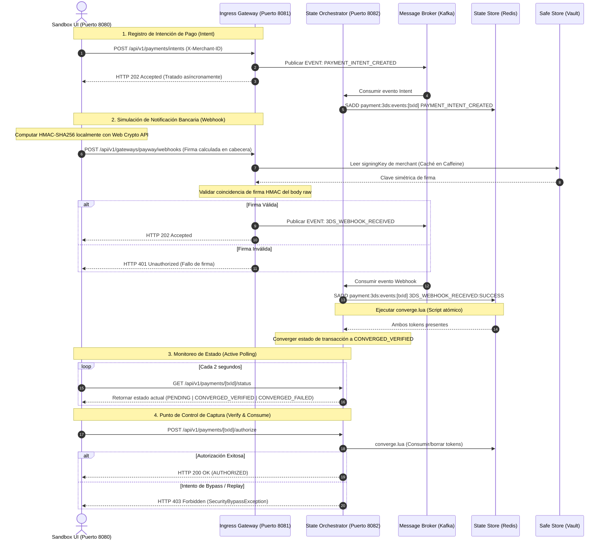

# 🛡️ AegisGate Checkout Sandbox UI

Este es el panel interactivo y sandbox de pruebas para **AegisGate**, un motor desacoplado de verificación y convergencia de estados de transacciones **3D Secure (3DS)**. La aplicación simula el comportamiento de una tienda online integrada y el flujo criptográfico de notificaciones asíncronas de la pasarela de pagos (Payway) en tiempo real.

Desarrollado con **React + TypeScript + Vite** y estilizado bajo una estética premium de *dark-mode glassmorphism* sin dependencias pesadas de diseño (CSS vainilla optimizado).

---

## 📊 Arquitectura del Ecosistema de Sandbox

El siguiente diagrama detalla cómo interactúa esta interfaz cliente con los microservicios de AegisGate y la infraestructura base:



---

## ⚙️ Componentes de la Interfaz

La aplicación se compone de tres paneles de control dinámicos:

### 1. Configuración de Credenciales (Credentials Config)
* Permite definir los endpoints de la API de **Ingress** y **Orchestrator**.
* Configuración de identificador de comercio (`Merchant ID`), token de API (`API Key`) y clave secreta de firma de Payway (`Signing Key`).
* **Persistencia local**: Guarda la configuración de forma segura en el `localStorage` del navegador para evitar reconfiguraciones al recargar.

### 2. Simulador de Checkout Intent
* Generación aleatoria automática de identificadores de transacción UUID.
* Selección de montos y monedas de cobro de la orden de compra.
* Envía peticiones autenticadas para simular el inicio de checkout de la tienda online cliente.

### 3. Simulador de Webhook de 3DS (Payway)
* **Criptografía In-Browser**: Calcula firmas `HMAC-SHA256` en tiempo real directamente en el cliente mediante la **Web Crypto API** (sin exponer claves en red), replicando exactamente el comportamiento seguro del backend de Payway.
* Simulación de respuestas aprobadas (`SUCCESS`) y denegadas (`FAILED`) por el desafío de autenticación 3DS del banco.

### 4. Monitor de Convergencia & Consola de Logs
* Representación gráfica del flujo de la máquina de estados de la transacción (`ID Generated` ➜ `Intent Registered` ➜ `3DS Verified` ➜ `Token Consumed`).
* Lector visual del estado consolidado en base de datos.
* Consola interactiva de depuración para rastrear peticiones, códigos de estado HTTP y logs criptográficos.

---

## 🛠️ Puesta en Marcha (Paso a Paso)

Sigue estos pasos para levantar todo el entorno local y realizar simulaciones completas:

### Requisitos Previos
* **Node.js** (v18+) y **npm**
* **Java 21 (JDK)**
* **Docker y Docker Compose**
* **Maven**

### Paso 1: Iniciar Backing Services (Docker)
Inicia los contenedores de Redis, Vault y Kafka con la configuración de replicación de base única para un nodo local:
```bash
# Desde la raíz del repositorio, navega a la carpeta de infraestructura docker
cd docker
docker compose up -d
```
*(Nota: Hemos configurado `KAFKA_OFFSETS_TOPIC_REPLICATION_FACTOR: 1` para permitir el registro de offsets del grupo consumidor local sin depender de un clúster distribuido).*

### Paso 2: Sembrar Secretos en Vault
Inicializa los secretos criptográficos para los comercios de prueba dentro del almacén seguro:
```bash
docker exec -e VAULT_ADDR="http://127.0.0.1:8200" -e VAULT_TOKEN="myroot" aegisgate-vault \
  vault secrets enable -path=secret kv-v2;

# Sembrar credenciales por defecto para merchant default-merchant
docker exec -e VAULT_ADDR="http://127.0.0.1:8200" -e VAULT_TOKEN="myroot" aegisgate-vault \
  vault kv put secret/merchants/default-merchant \
  signingKey="test-secret-key-123" \
  apiKey="default-api-key-111"
```

### Paso 3: Ejecutar Microservicios Java
Abre dos terminales de tu sistema y arranca las aplicaciones de AegisGate:

* **Terminal 1: Ingress Gateway (Puerto 8081)**
  ```bash
  mvn -pl aegisgate-ingress spring-boot:run "-Dspring-boot.run.arguments=--spring.profiles.active=dev" "-Dspotless.check.skip=true" "-Dspotless.skip=true"
  ```
* **Terminal 2: State Orchestrator (Puerto 8082)**
  ```bash
  mvn -pl aegisgate-orchestrator spring-boot:run "-Dspring-boot.run.arguments=--spring.profiles.active=dev" "-Dspotless.check.skip=true" "-Dspotless.skip=true"
  ```

### Paso 4: Levantar la Interfaz React (Puerto 8080)
Navega al directorio del frontend, instala las dependencias e inicia el servidor de desarrollo de Vite:
```bash
cd aegisgate-sandbox-ui
npm install
npm run dev
```

Abre tu navegador en [http://localhost:8080/](http://localhost:8080/).

---

## 🧪 Guía de Simulación E2E (Escenario Exitoso)

Para probar la robustez del sistema y la consolidación de estados:

1. **Configurar Credenciales**: Valida que la URL de Ingress sea `http://localhost:8081`, la de Orchestrator `http://localhost:8082`, el Merchant ID sea `default-merchant` y la Signing Key coincida con la sembrada en Vault (`test-secret-key-123`). Haz clic en **Save in LocalStorage**.
2. **Crear Transacción**: Haz clic en el botón de recarga (junto al UUID de transacción) para generar un identificador único y presiona **Initiate Checkout Intent**.
   * *Consola*: Verás que se registra la intención y retorna un código `202 Accepted`.
   * *Estado*: Cambiará a `PENDING` y el monitor indicará `Intent Registered`.
3. **Simular Webhook 3DS**: Selecciona el resultado 3DS como `SUCCESS` y haz clic en **Simulate Payway Webhook Notification**.
   * *Consola*: Se calcula el HMAC-SHA256 simétrico de la carga útil del webhook y se envía a Ingress con la cabecera `X-Payway-Signature`. Se recibe `202 Accepted`.
   * *Estado*: En un plazo máximo de 2 segundos, el monitor detectará la convergencia, actualizando el estado de la transacción a `CONVERGED_VERIFIED` y marcando la etapa como `3DS Verified`.
4. **Verificación y Captura**: Haz clic en **Verify & Consume Checkout Charge** (el cual se ha habilitado automáticamente).
   * *Consola*: Retorna `200 OK` con código `AUTHORIZED`, confirmando que el orquestador validó los tokens en Redis y consumió la clave de la transacción, mitigando vulnerabilidades de replay y bypass.
